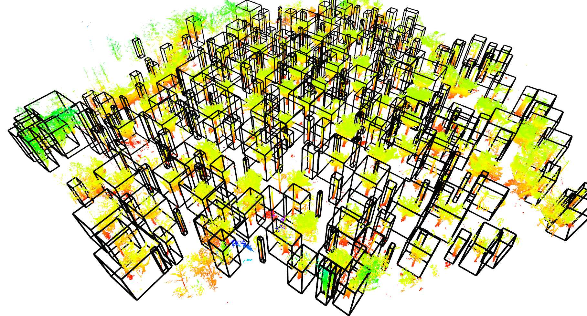
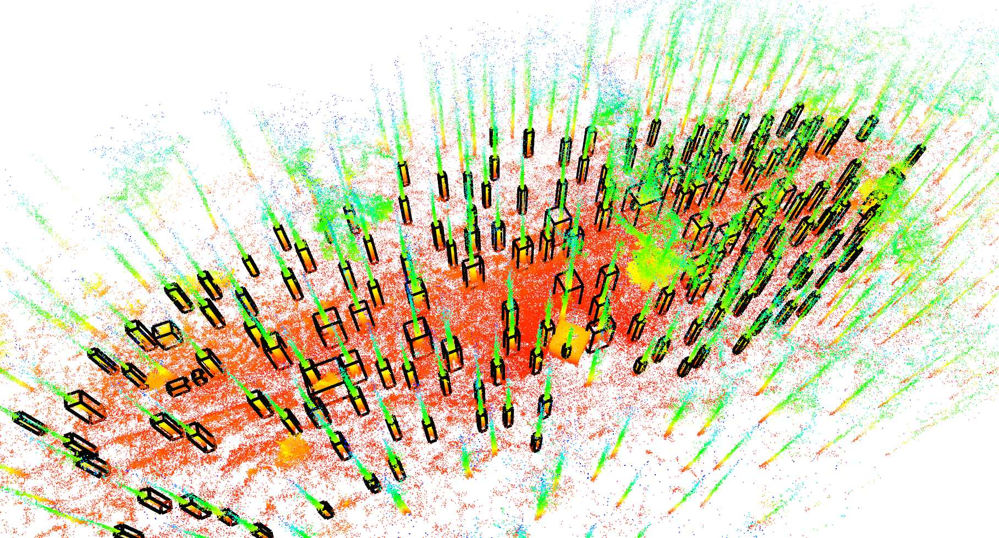
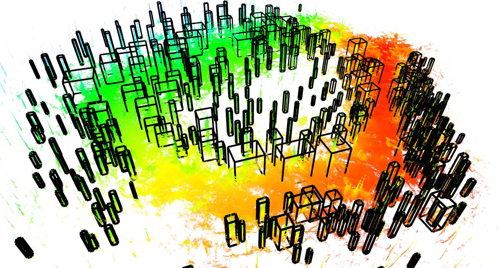

# tree_detection

## Overview

This package provides tree detection on pointcloud data. In particular, it is designed for detecting tree trunks which could later be used for tree grabbing and harvesting. It does not provide the full tree segmentation with the crown. The package was developed in the scope of [1] (see below).

The functionality was developed for an autonomous harvester where the goal is to detect trees in a local map. Nonetheless, it can also be used on large maps to compute tree coordinates or get an estimate of tree density.

Released under [BSD 3-Clause license](LICENSE).

**Author:** Edo Jelavic

**Maintainer:** Edo Jelavic, [jelavice@ethz.ch](jelavice@ethz.ch)

Examples of tree detection on point clouds:

| forest 2 (ground removed)| forest 3 | forest 4 |
|:--------:|------------------|--------------|
|[](doc/forest2.jog)|[](doc/forest3.jpg)|[](doc/forest4.jpg)|

## Publications
The code for tree detection has been developed as a part of research on autonomous precision harvesting. If you are using this tree detector in academic context, please consider adding the following citation to your publication:

[1] Jelavic, E., Jud, D., Egli, P. and Hutter, M., 2021. Towards Autonomous Robotic Precision Harvesting: Mapping, Localization, Planning and Control for a Legged Tree Harvester.
 
    @article{jelavic2021towards,
        title={Towards Autonomous Robotic Precision Harvesting: Mapping, Localization, Planning and Control for a Legged Tree Harvester},
        author={Jelavic, Edo and Jud, Dominic and Egli, Pascal and Hutter, Marco},
        journal={Field Robotics},
        year={2021},
        publisher={Wiley}
    }
   
## Packages in this repo
This repository consists of following packages:

* ***ground_plane_removal*** is a lightweight package for ground plane removal. 
* ***tree_detection*** implements the core algorithm for tree detection. 
* ***tree_detection_ros*** adds visualization and I/O handling for easier usage. This package is tightly integrated with ROS.


## Algorithm description

The algorithm first attempts to remove the gound plane. This can be done using two strategies, either a simple box filter (for which the user needs to provide the cropping region) or using an elevation map. In case the elevation map strategy is used, the algorithm first computes the elevation map and then uses it to remove the ground plane. The elevaiton map computation is implemented in a different package (see the link [here](https://github.com/ANYbotics/grid_map/tree/master/grid_map_pcl)) and a more detailed description can be found in [1]. Before proceeding with the pointcloud processing the median filter is applied to the elevation map.

Once the ground plane is removed, the algorithm proceeds with Euclidean cluster extraction and performs some checks to make sure that the extracted clusters aree indeed trees. The more detailed description can be found in [1].

## Installation

Clone the following dependencies:
```bash
# in your source folder `src`
git clone https://github.com/ANYbotics/grid_map.git
```

Install the ROS and library dependencies with:
```bash
sudo apt install -y ros-noetic-pcl-ros ros-noetic-pcl-conversions ros-noetic-jsk-recognition-msgs ros-noetic-tf2-geometry-msgs 
# OR, use rosdep in your source folder `src` 
sudo rosdep install -yr --from-paths .
```
In case you want to use the detection boxes for visualization you will have to install the [jsk_rviz_plugins](http://wiki.ros.org/jsk_rviz_plugins).
```bash
sudo apt install ros-noetic-jsk-visualization
```
Recommended to build in release mode for performance (`catkin config -DCMAKE_BUILD_TYPE=Release`)

Build with:  
```bash
catkin build tree_detection_ros
```
In case you want to visualize the elevation map created by the ground plane remover, you should compile the grid_map_rviz_plugin as well:
```bash
catkin build grid_map_rviz_plugin
```


## Usage & Examples

The example datasets can be downloaded [here](https://drive.google.com/drive/folders/1m_sRtMN5n6-ShQvnbCfedKIVpoupao5u?usp=sharing). The folder contains five forest patches.  One dataset has almost no clutter (forest3.pcd) and two have a lot of branch clutter (forest1.pcd and forest2.pcd). 

This package can also work with forests on inclined surfaces and we provide two examples (forest4.pcd and forest5.pcd). The point clouds forest4.pcd and forest5.pcd were taken from the [The Montmorency dataset](https://norlab.ulaval.ca/research/montmorencydataset/) and downsampled. Note that for these datasets, we recommend to use a slightly different tuning. See `tree_detection_dataset_4_and_5.yaml`.

Modify the `pcd_filepath` inside the `tree_detection.launch` to point the location where the point clouds `.pcd` files are stored.  
If you want to use a different configuraiton file, you will have to modify the `config_filepath` as well. The ground plane removal strategy can be selected by setting the value of `ground_removal_strategy` parameter.

Run with:
```bash
roslaunch tree_detection_ros tree_detection.launch
```
The node publishes the input pointcloud, the pointcloud with the ground removed and the elevation map used to remove the ground plane. The detected trees will be marked with green cylinders and bounding boxes. The visualization should appar in the Rviz window.

Note that the computation can last for up to 7-9 minutes for larger datasets (e.g. forest4.pcd and forest5.pcd). This can be shortened with different tuning, downsampling or voxelizing the point clouds.


## Parameters

* `ground_plane_removal/cropbox` - Limits (XYZ) for the ground plane removal. The points contained within the box specified by the user will be kept and the rest will be removed. The tree detection will proceed on the remaining points.
* `ground_plane_removal/elevation_map` - Parameters for elevation map extraction from the pointcloud are described [here](https://github.com/ANYbotics/grid_map/tree/master/grid_map_pcl). We add a couple of new parameters which are listed below.
* `ground_plane_removal/min_height_above_ground` - minimal height above the extracted elevation map to keep the points. Any points below this threshold will be discarded. Note that this number can also be negative.
* `ground_plane_removal/max_height_above_ground` - maximal height above the elevation map to keep the points. Any points above this threshold will be discarded.
* `ground_plane_removal/is_use_median_filter` - whether to apply the median filter on the elevation map.
* `ground_plane_removal/median_filtering_radius` - median filtering radius for the elevation map. For each cell, the filter will take the data from the neighbouring cells withing specified radius and apply the median filter. The number of neighbouring points depends on the cell size and this parameter.
* `ground_plane_removal/median_filter_points_downsample_factor` - If one wishes to have sparser coverage, you can apply downsampling. The algorithm will calculate all the points within the specified radius and divide their number by this factor. E.g., (if there are 50 neighbouring points within the radius and the downsample factor is set to 5, 10 points will be used for median filtering).


